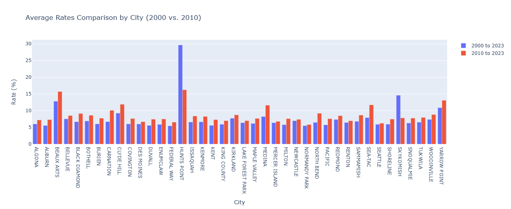

    <h1>
        Seattle Housing Market Analysis Project
    </h1>
    
<b>Download HTML file to view full report!</b>

    <h2>
        Research Questions:
        <ol>
            <li>What is the rate of average annual income growth vs. the rate of growth for home prices?</li>
            <li>How have housing prices changed over time in Seattle?</li>
            <li>Which factors have the highest correlation to the pricing trends in the Seattle area (best predictor)?</li>
        </ol>
    </h2>
    <h3 align='center'>
        <b>Technologies Used</b>
    </h3>
    

        
        
        
        
        
    

## Table of Contents
- [Showcase](#showcase)
- [Key Findings](#key-findings)
- [Conclusion](#conclusion)
  
# Showcase

## Key Findings
Research Question 1:
- Average Annual Income Growth in the King County Area from *2000 - 2023* is **$2,423.73** or an average of **4.31%** per year
- Average Annual Income Growth in the King County Area from *2010 - 2023* is **$3,800.02** or an average of **5.70%** per year
- All cities in King County, regardless of the date of analysis, had an average housing rate **increase of over 5 %**
- Seattle's housing market saw an average of **$32,731.85 increase per year**
- The city of Hunt's Point saw the greatest increase in housing prices per year at an **average of $255,840.16**
- The city of Skyhomish saw the smallest increase in housing prices per year at an **average of $10,721.42**
- Housing prices have grown at a much higher rate from 2010 compared to 2000 for all cities (except for Hunt's Point)
- **Average Annual Income Growth rates have been slower than Average Home Pricing Rates in all cities within the King County**

Research Question 2:
- Home sales in Seattle have **increased by an average of $32,731.85** per year since 2000
- Home sales have **increased by an average rate of 5.92%** per year since 2000
- Home sales saw a decrease between 2007 and 2009 due to The Great Recession
- Seattle reached a high average of **$689.87 per sqft** in 2022

Research Question 3:
- The average home sales prices are most correlated to annual income trends at **0.99 correlation**
- The average home sales prices are least correlated to unemployment rate at **-0.36 correlation**
- Population is also strongly correlated with average sales prices in Seattle at **0.94 correlation**
- **Annual income in the Seattle area is most indicative (best predictive variable) for sales prices in Seattle**

## Conclusion

**Home Appreciation Trends and Fluctuations**

Analysis of home appreciation percentages reveals varied trends across different cities. Cities east of Seattle, like Bellevue and Mercer Island, exhibited the most significant fluctuations in home value appreciation, whereas Seattle displayed more stable home values over the years. The highest standard deviations in home appreciation values were observed in lake-side cities, indicating more considerable volatility in these areas.

Insight: The geographic variation in home value fluctuations suggests that local factors, such as proximity to lakes and urban centers, may drive market dynamics. Understanding these trends can guide targeted housing policies and investment strategies.

**Research Question 1: Trends in Income and Housing Price Growth**

The data reveals significant trends in both income growth and housing price increases in King County from 2000 to 2023. The average annual income growth over this period was $2,423.73, with a more accelerated growth of $3,800.02 annually from 2010 to 2023. This corresponds to an average yearly increase of 4.31% and 5.70%, respectively. Despite these income gains, housing prices in all cities consistently grew at rates exceeding 5%, with Seattle experiencing an annual increase of $32,731.85.

Hunt’s Point stood out with the highest housing price surge, averaging $255,840.16 per year, whereas Skykomish saw the smallest increase at $10,721.42 annually. Notably, the pace of housing price growth intensified post-2010 across the region, contrasting the slower income growth rates, underscoring a potential affordability challenge for residents.

Insight: The disparity between income growth and housing price escalation highlights the need for strategies to address housing affordability and ensure that income growth can better support homeownership in the area.

**Research Question 2: Home Sales Trends in Seattle**

Seattle's home sales have witnessed a consistent average increase of $32,731.85 per year since 2000, equating to a 5.92% annual growth rate. This trajectory faced a setback during The Great Recession (2007-2009), but recovery and subsequent growth pushed the average price per square foot to $689.87 by 2022.

Insight: The resilience of Seattle’s housing market post-recession indicates strong demand and potential market stability. However, monitoring economic fluctuations is essential to predict and mitigate future downturns.

**Research Question 3: Correlation between Home Sales Prices and Socioeconomic Factors**

The correlation analysis identifies annual income as the most predictive factor for home sales prices in Seattle, with a correlation coefficient of 0.99. Conversely, unemployment rates show the weakest correlation at -0.36. Population growth also strongly correlates with sales prices, at 0.94.

Insight: The strong correlation between income and home prices suggests that economic policies aimed at income growth can directly influence housing affordability. Policymakers should consider this linkage when designing housing and economic development initiatives.
